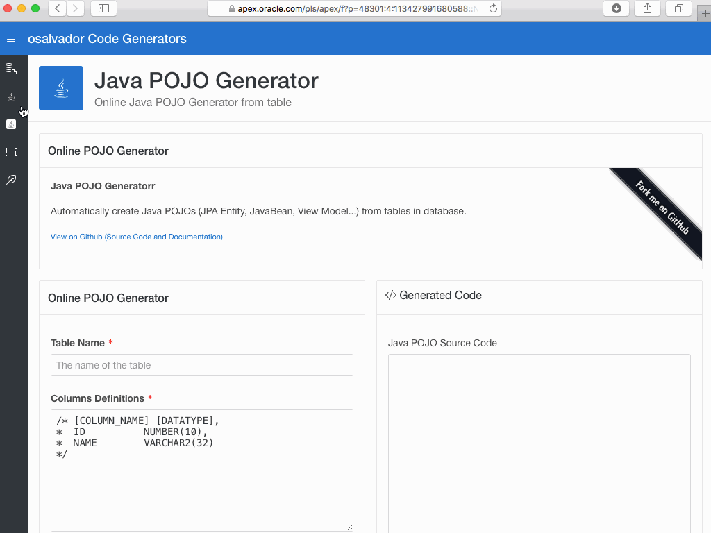
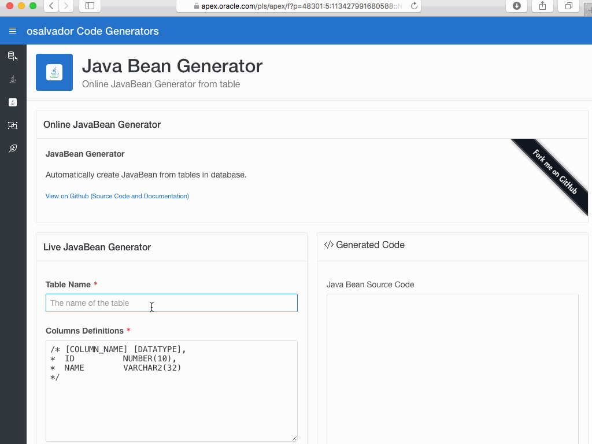
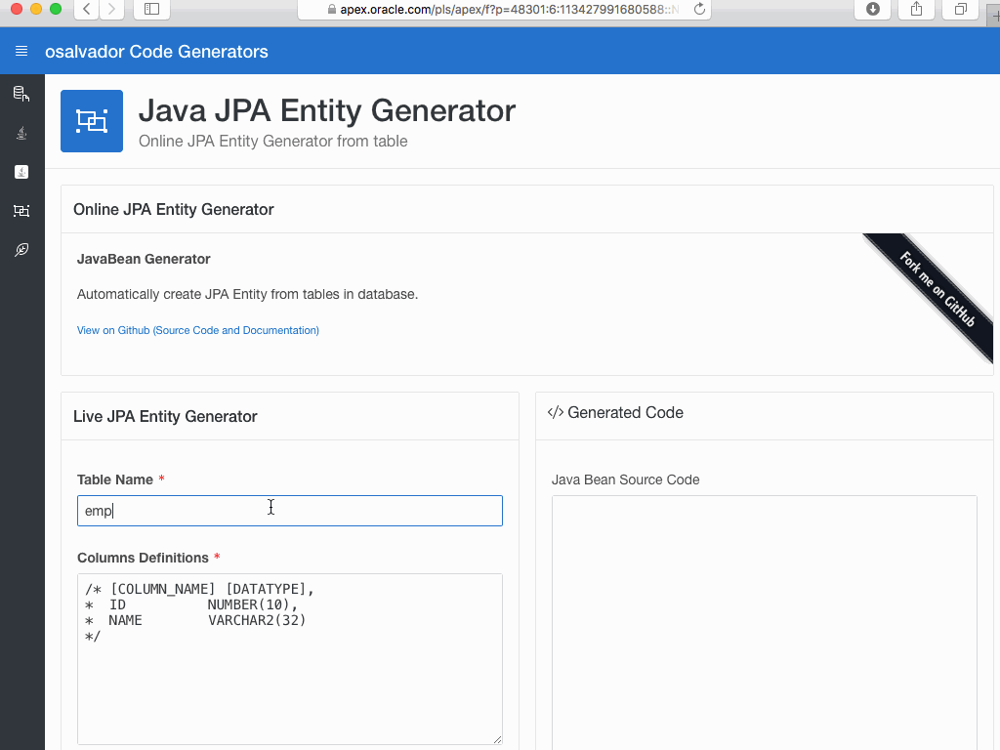

# OsalvadorCodeGenerators

OsalvadorCodeGenerators se trata de una aplicación web para la generación de código fuente dada la definicion (DML) de una tabla de base de datos. El generador se define en plantillas de tePLSQL (estilo de JSP (<%%>) y PSP) y el resultado se muestra por pantalla. La aplicación web se ha desarrollado con APEX en apex.oracle.com. Actualmente se han incluido las plantillas que suelo usar en mi trabajo, pero como se puede observar, las plantillas son facilmente personalizables. 

### Demos

#### Java POJO Generator

The template: [pojo.teplsql](./templates/pojo.teplsql)

#### Java Bean Generator

The template: [bean.teplsql](./templates/bean.teplsql)

#### Java JPA Entity Generator

The template: [jpa-entity.teplsql](./templates/jpa-entity.teplsql)

#### JdbcTemplate DAO Generator

The Interface template: [jdbctemplate-dao-interface.teplsql](./templates/jdbctemplate/jdbctemplate-dao-interface.teplsql)
The Interface Implementation template: [jdbctemplate-dao-implement.teplsql](./templates/jdbctemplate/jdbctemplate-dao-implement.teplsql)

## ¿Por qué otro generador de código?

Estamos acostumbrados a este tipo de generadores de código, que nos crean los modelos, entidades o DTOs basados en las tablas de nuestras bases de datos. El problema de estos generadores de código es requieren de una instrumentación (instalación y configuración) y un aprendizaje de uso que en ocasiones es mayor el tiempo que le dedicamos a esto que lo que podemos ahorrar generando el código. 

Con una aplicacion web nos ahorramos todos estos pasos previos y nos centramos en lo que realmente nos importa, obtener la parte aburrida de nuestro proyecto, generar estas clases. 

Finalmente estoy trabajando en la generación de aplicaciones ejecutables, que el codigo fuente generado sea completamente ejecutable. 

## Roadmap

- Enable the ability to upload a complete DML script with multiple tables.
- More templates:
	- Custom templates
	- Spring boot RestFull app
	- Complete JEE CRUD app
	- C# POCO
- MySQL and Postgres DDL syntax compatibility. 

## SQL Data Type to Java Mapping Classes

| SQL Data Type | Java Mapping | 
| ------------- | ------------ | 
| `VARCHAR2`          | `String`
| `CHAR`              | `String`
| `CHARACTER`         | `String`
| `LONG`              | `String`
| `STRING`            | `String`
| `VARCHAR`           | `String`
| `RAW`               | `byte[]`
| `LONG RAW`          | `byte[]`
| `BINARY_INTEGER`    | `int`
| `NATURAL`           | `int`
| `NATURALN`          | `int`
| `PLS_INTEGER`       | `int`
| `POSITIVE`          | `int`
| `POSITIVEN`         | `int`
| `SIGNTYPE`          | `int`
| `INT`               | `int`
| `INTEGER`           | `int`
| `SMALLINT`          | `int`
| `DEC`               | `BigDecimal`
| `DECIMAL`           | `BigDecimal`
| `NUMBER`            | `BigDecimal`
| `NUMERIC`           | `BigDecimal`
| `DOUBLE PRECISION`  | `double`
| `FLOAT`             | `double`
| `REAL`              | `float`
| `DATE`              | `Timestamp`
| `TIMESTAMP` 		 | `Timestamp`
| `INTERVAL` 		 | `String`
| `ROWID`            | `RowId`
| `UROWID`           | `RowId`
| `CLOB`             | `Clob`
| `BLOB`             | `Blob`
| `XMLTYPE`          | `String`

